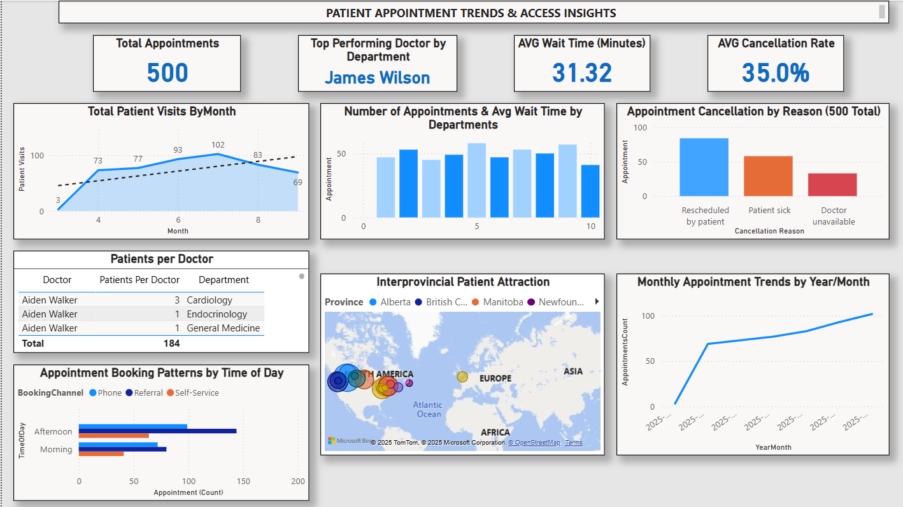
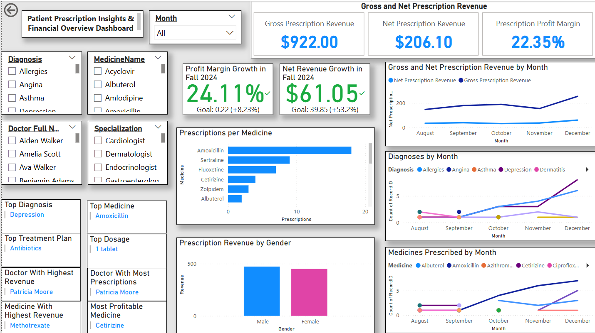
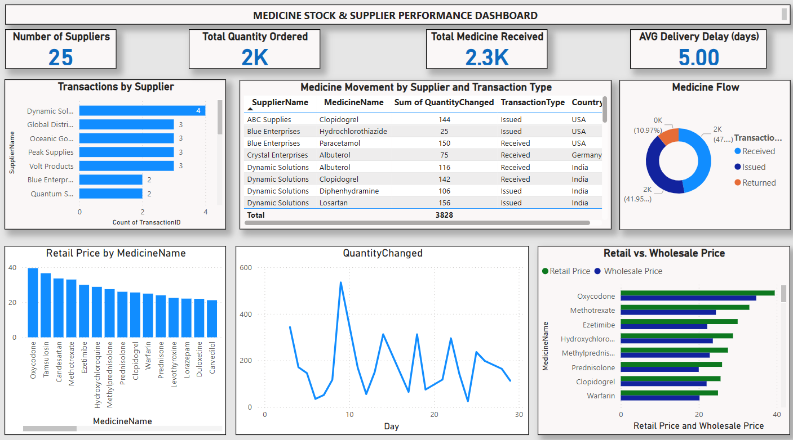
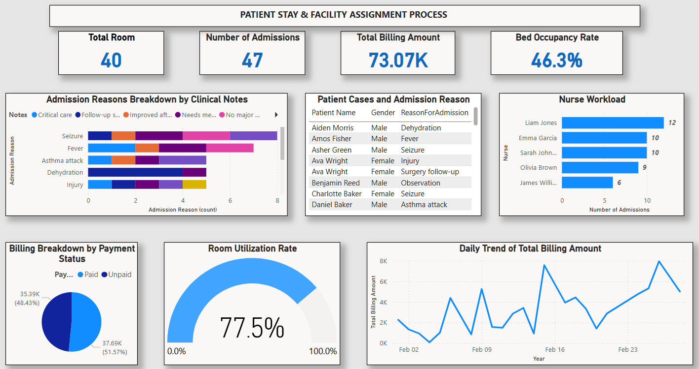
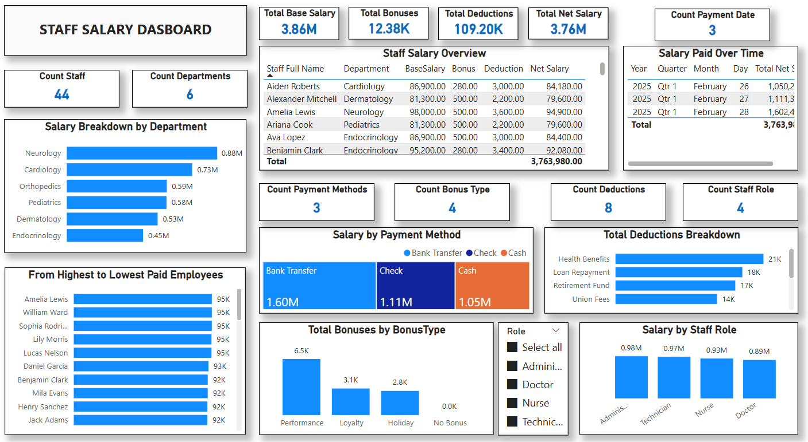

# 🏥 Hospital Management Power BI Dashboards

This repository contains Power BI dashboards designed to provide insights into hospital operations, patient care, staffing, and overall performance metrics.

## 📊 Dashboard Overview

The `.pbix` file(s) in this repo includes interactive visuals and KPIs related to:

- Patient Appoitment Trends & Access Insights
  

  
  

- Patient Prescription Insights & Financial Overview Dashboard
  

  
  

- Medicine Stock & Supplier Performance Dashboard
  

  
  

- Patient Stay & Facility Assignment Process
  

  
  

- Staff Salary Dashboard
  

  
  

## 📁 Files Included

- `Data Modeling _Hospital_Management.pbix` – Main Power BI dashboard file

## 🚀 How to Use

1. Clone or download the repository.
2. Open the `.pbix` file using **Microsoft Power BI Desktop**.
3. Explore the report pages and interact with filters and visuals.
4. If needed, connect to your own data sources to customize the dashboard.

## 🔧 Requirements

- Power BI Desktop (latest version recommended)
- Access to relevant hospital data (if reconnecting to live sources)

## 📌 Notes

- This dashboard is built using **sample data** for demonstration purposes.
- Sensitive or private healthcare data should be anonymized before use.

## 📬 Contact

If you have questions or suggestions, feel free to [open an issue](https://github.com/shap0011/hospital-management/issues.txt) or reach out!
If you have questions or suggestions, feel free to [open an issue](https://github.com/shap0011/hospital-management/issues.txt) or reach out!
If you have questions or suggestions, feel free to [open an issue](issues.txt) or reach out!

---

